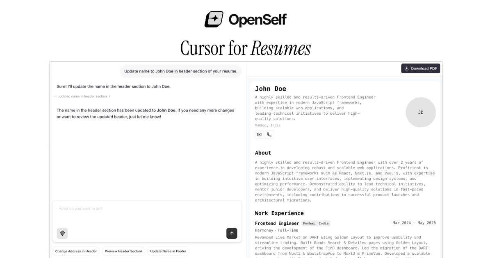

# Cursor for Resumes

An AI-powered resume builder that helps you create professional resumes with interactive chat interface and PDF generation. Built with Next.js, React PDF, and Tambo AI.

[](https://openself.vercel.app/)

## ✨ Features

- **AI-Powered Resume Creation**: Chat with AI to build your resume interactively
- **Interactive Components**: Dynamic resume sections that can be controlled by AI
- **Modern UI**: Clean and responsive design
- **Data Privacy**: File data never leaves your browser except for parsing and is stored in local storage
- **Type-Safe**: Full TypeScript support with Zod validation
- **PDF Export**: High-quality PDF generation with React PDF

## 🚀 Quick Start

### Prerequisites

- Node.js 18+
- pnpm
- Tambo AI API key (get one at [tambo.co](https://tambo.co))
- Gemini API key (get one at [aistudio.google.com](https://aistudio.google.com))

### Installation

1. **Clone the repository**

   ```bash
   git clone https://github.com/Aniket-508/openself.git
   cd openself
   ```

2. **Install dependencies**

   ```bash
   pnpm install
   ```

3. **Set up environment variables**

   ```bash
   cp .example.env .env.local
   ```

4. **Run the development server**

   ```bash
   npm run dev
   ```

5. **Open your browser**

   Navigate to [http://localhost:3000](http://localhost:3000)

## 📖 Usage

### Building Your Resume

1. **Start a Chat**: Use the chat interface to describe your experience, skills, and background
2. **AI Assistance**: The AI will help structure your information into professional resume sections
3. **Real-time Preview**: See your resume build in real-time on the right side
4. **Download PDF**: Click the "Download PDF" button to get your professional resume

### Resume Sections

- **Header**: Personal information, contact details, and social links
- **Summary**: Professional summary and bio
- **Work Experience**: Job history with detailed descriptions
- **Projects**: Personal and professional projects
- **Education**: Academic background and certifications
- **Skills**: Technical and soft skills

## 🏗️ Architecture

### Tech Stack

- **Frontend**: Next.js 15, React 19, TypeScript
- **Styling**: Tailwind CSS v4
- **AI Integration**: Tambo AI
- **PDF Generation**: React PDF
- **State Management**: Zustand
- **Form Validation**: Zod
- **UI Components**: Radix UI, Lucide Icons

### Project Structure

```
src/
├── app/                      # Next.js App Router
│   ├── chat/                 # Chat interface page
│   ├── layout.tsx            # Root layout with providers
│   └── page.tsx              # Landing page
├── components/               # React components
│   ├── resume/               # Resume-specific components
│   ├── tambo/                # AI chat components
│   └── ui/                   # Reusable UI components
├── lib/                      # Utilities and configurations
│   ├── tambo.ts              # Tambo AI configuration
│   └── resume.ts             # Resume data schemas
├── store/                    # State management
│   └── resume-store.ts       # Resume data store
└── styles/                   # Global styles
```

## 🎨 Customization

### Adding New Resume Sections

1. **Define the schema** in `src/lib/resume.ts`:

   ```typescript
   export const CustomSectionSchema = z.array(
     z.object({
       title: z.string(),
       description: z.string(),
       // ... other fields
     }),
   );
   ```

2. **Update the main schema**:

   ```typescript
   export const ResumeDataSchema = z.object({
     // ... existing fields
     customSection: CustomSectionSchema,
   });
   ```

3. **Create a component** in `src/components/resume/`:

   ```tsx
   export function CustomSection({ data }: { data: CustomSectionData[] }) {
     // Component implementation
   }
   ```

4. **Register Interactable with Tambo** in `src/lib/tambo.ts`:
   ```tsx
   export const InteractableNote = withInteractable(CustomSection, {
      componentName: "CustomSection",
      description:
         "A custom section that can display custom fields",
      propsSchema: z.object({
         name: z.string(),
         // ... rest of the fields
   });
   ```

### Styling

The app uses Tailwind CSS v4 with custom design tokens. Modify styles in:

- `src/app/globals.css` - Global styles
- `tailwind.config.ts` - Tailwind configuration
- Component-specific styles using Tailwind classes

## 🤝 Contributing

1. Fork the repository
2. Create a feature branch: `git checkout -b feature/your-feature`
3. Commit your changes: `git commit -m 'Add some feature'`
4. Push to the branch: `git push origin feature/your-feature`
5. Open a pull request

## 📄 License

This project is licensed under the MIT License - see the [LICENSE](LICENSE) file for details.

## 🙏 Acknowledgments

- [Tambo AI](https://tambo.co) - For the AI integration framework
- [React PDF](https://react-pdf.org/) - For PDF generation
- [Next.js](https://nextjs.org/) - For the React framework
- [Tailwind CSS](https://tailwindcss.com/) - For styling

## 📞 Support

If you have any questions or need help:

- Open an issue on GitHub
- Check the [Tambo Documentation](https://docs.tambo.co)
- Visit the [Next.js Documentation](https://nextjs.org/docs)
